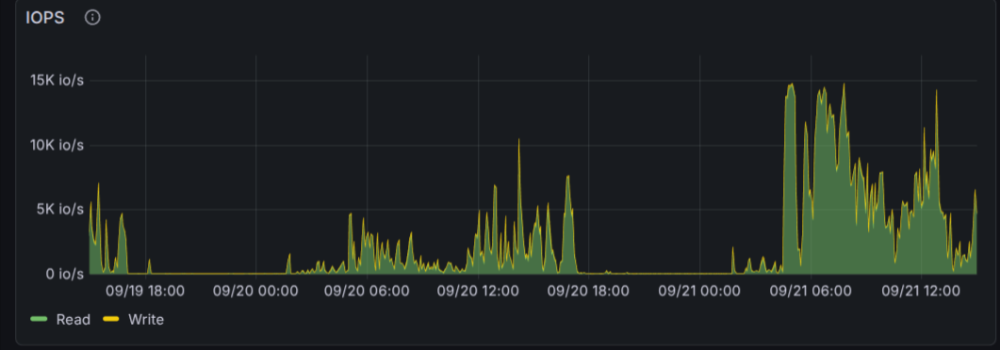
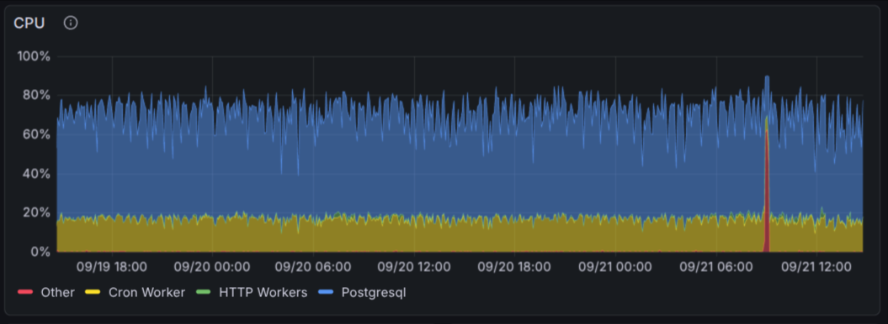
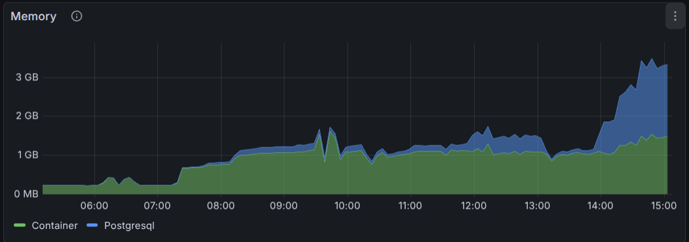
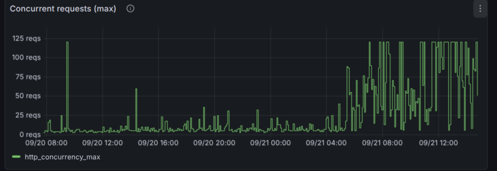
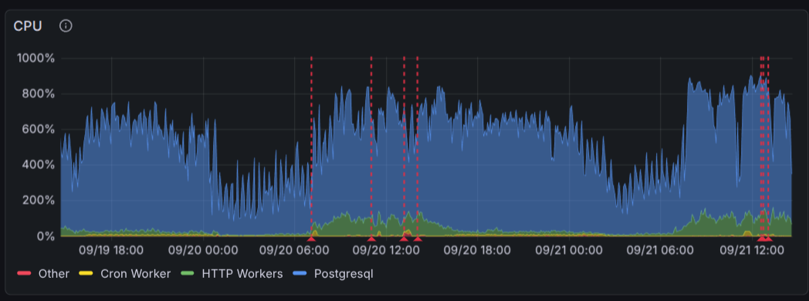
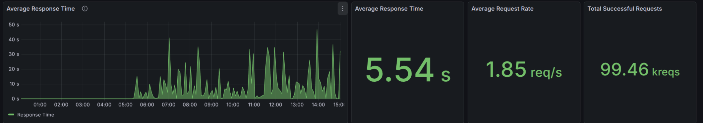
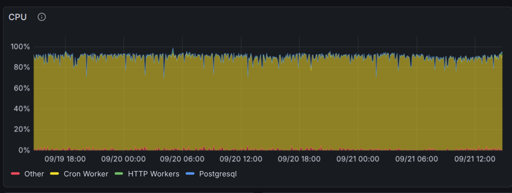
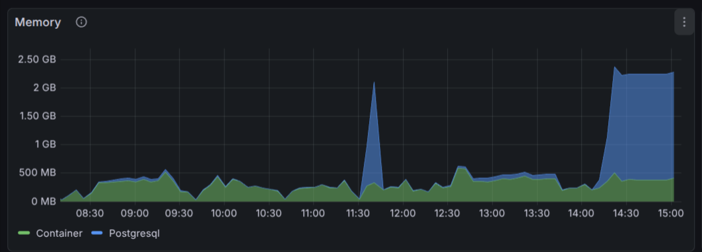
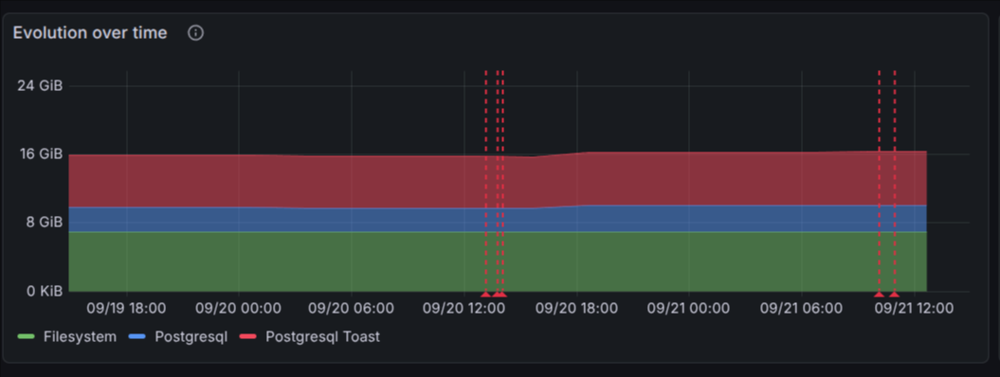

# Odoo.sh Masterclass — Exercises

## Source

- Odoo.sh documentation https://www.odoo.com/documentation/master/administration/odoo_sh.html
- Odoo.sh FAQ: https://www.odoo.sh/faq

- Upgrade documentation:
    - https://www.odoo.com/documentation/master/administration/upgrade.html
    - https://www.odoo.com/documentation/master/developer/howtos/upgrade_custom_db.html
    - https://www.odoo.com/documentation/master/developer/reference/upgrades/upgrade_scripts.html

## Context

Most exercises will be done in version 17.0, and will be followed by an upgrade to 19.0.


## Exercises

**🏋 Exercise 1 - deploy production**
Create a production instance with your prod branch.

**🏋 Exercise 2 - new module and deploy**
- Check if branch 17.0 is all right on your staging branch.
- Merge branch 17.0 into your production branch.
- Update the apps list and install it manually, then check that everything is working correctly.
- Add some data in your instance (sessions).

**🏋 Exercise 3 - add new field and deploy (computed) - new feature with a computed field**
We want to deploy the development done in branch 17.0-failed-test. Check in dev:
- If the test runs, what command line is used, etc...
- If necessary, fix it.

**🏋 Exercise 4 - Add some secret in production**
- Add a secret in System Parameters
- Create a staging branch
- Check the value on the staging branch
- Create data/neutralize.sql on the production branch
- Then rebuild the staging branch

**🏋 Exercise 5 - Performance analysis**
Test the 17.0-perf-issue branch in development, with demo data. In the webshell run:
```bash
odoo-bin populate --size=large --models=conference.session -d $PGDATABASE --stop-after-init --no-http
```
Displaying the Sessions list is slow — analyze it with the platform tools.
Use the odoo-bin shell to confirm and fix it.
After it's good, rebase the branch on prod, test it in staging and deploy in production.


**🏋 Exercise 6 - Diagnose the graph**
Each of the 9 graphs below is a different situation captured from a real build.

Each graph is its own standalone situation, from a different instance — they are not related to
each other. For each graph, decide:
- What is actually happening? (CPU / memory / IOPS / concurrent requests / response time)
- Is this a problem, or is it expected?
- What would you actually do about it, if anything?




















**🏋 Exercise 7 - upgrade to 19.0 (staging, then production)**

We want to upgrade to version 19.0. While upgrading we want to modify 2 fields as well:
- speaker (Char) should be replaced by presenter_id (Many2one pointing to res.partner)
- duration (Integer in minutes) becomes duration (Float in hours)

Make sure your data is migrated correctly during the upgrade process.
